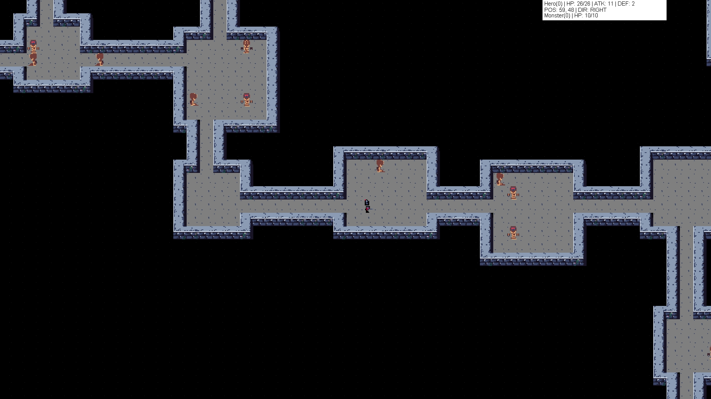

# Yet Another Roguelike

A small prototype of a roguelike game. Demonstrates usage of Java Swing and Java AWT to create desktop applications and
process user input.

## Main concepts

1. Hero can move in four directions and attack a monster if they are in adjacent cells.
2. Hero can only move on floor tiles, walls are "solid," and cannot be passed _(some mechanics can be added later, e.g.,
   climbing or destroying the walls, or having secret passes)._
3. Monsters AI is reactive, meaning:
    * Monsters move at the same time as hero moves, and their AI is basic, randomly picking floor tile from
      adjacent _(group behavior and path finding, following, etc. can be added later)._
    * Each hero's attack is counterattacking by the monster at the same time _(attack speed modifiers can be added
      later)_.

## Combat

When monster and player occupy adjacent cells, you can perform an attack by pressing "Space" or "Left Click."

## Game Screenshot

## Engine implementation

The game runs a loop, every cycle updates player position updated by keyboard events, and updates monsters positions in
turn, using AWT Event Dispatch Thread.

## TODOs

1. Fix game loop, add scene flow
2. After killing some monsters, a boss monster spawns and drops a key to the next level upon death.
3. Hero must find a door to unlock the next level.
4. The next level is another dungeon of the same type _(later additional tiles will be added, and new layouts)_
5. Refactor HUD to be reactive panels
6. Add boss with next level condition
7. Inject everything that may be configurable: counts, file paths, sizes, etc.
8. Think about Z-axis implementation, with stairs and displaying only particular elevation level rooms
9. multi-tile entities
10. Random monster affixes e.g., snake poison with animate dead effect